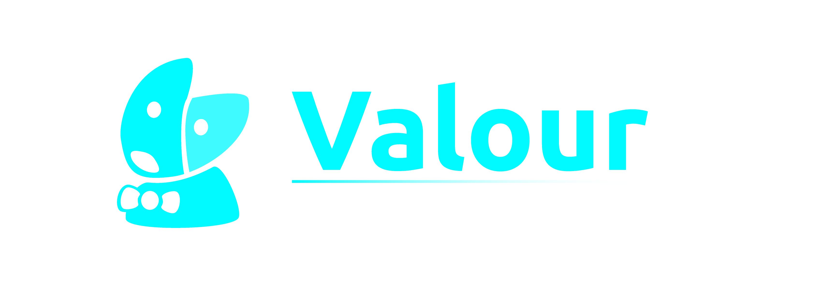
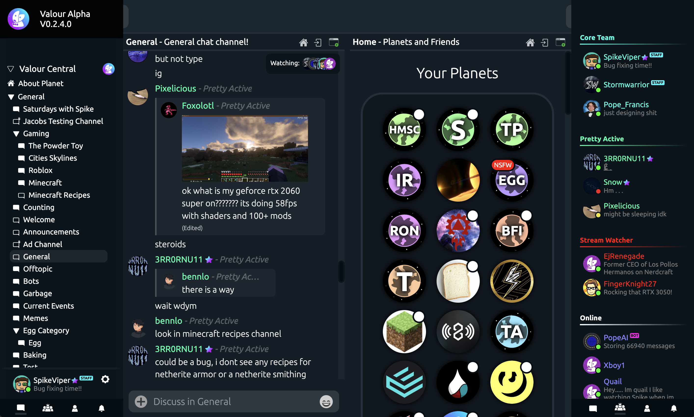
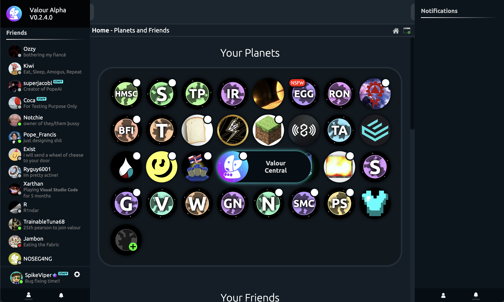

# Valour

### Valour is an open-source, modern chat client designed by communities for communities.
## Try it at: [https://valour.gg/](https://valour.gg/)
 

## Design

Valour is designed to be as flexible as possible - with a client built atop an official API for use in bots and applications. Valour is open-source, and your personal client can be as creative as your imagination allows. We believe in an open ecosystem for Valour - and hold bot authors to follow in our transparency to respect user data and privacy.

 

### Windows and Multi-chat

Valour's client allows you to open multiple chats at once - even across several communities. Valour's flexible in-built window system allows you to multitask, and for moderation teams to keep an eye on the action. Every chat window is dynamic and responsive, allowing you to resize and space your chats how you want. It's your client, after all.

 

### Planets and Communities

Planets are the communities of Valour, allowing you to build your ideas and foster strong interactions. With role management and per-channel permissions, you can ensure that your community is managed how you see fit.

 

### Economies and Items

Planets can deploy a currency and economic system in two clicks. Why? Don't bother managing 20 different 'coins' and 'xp' from different bots, and use one built-in system to handle user value tracking. Users can send your currency to each other in the community, and even trade it for community-defined items. You can even hook the API into your own systems, allowing your community members to pay for custom perks and be rewarded for anything!

 

### Total-Outage-proof Node System

Valour Nodes are designed to be able to run independantly of any central server or service. One node failing has no effect on other nodes, allowing Valour to scale safely and efficiently. Our logical-server based system, rather than depending on cloud services, also allows us to be provider-agnostic, hosting Valour across different providers and giving us the ability to dedicate resources to large communities that need it.

## Contibute

To contribute to Valour, getting a mock server environment set up is crucial. Here's a simple walkthough:

1. Install .Net 8 at [https://dotnet.microsoft.com/en-us/download/dotnet/8.0](https://dotnet.microsoft.com/en-us/download/dotnet/8.0)
2. We suggest using Rider or Visual Studio, but any IDE supporting dotnet should work. Make sure it supports .Net 8
3. Open the .sln file in the root project folder with your IDE. Open the terminal and run `dotnet workload restore`
4. Now we can run Valour, but it will immediately crash because required services are missing.
5. Install locally or deploy PostreSQL to a server [https://www.postgresql.org/](https://www.postgresql.org/)
6. There are two database schemas in the project you should use on this postgres server. Both are named `definitions.sql` and when run will create all the necessary tables. One is located in `Valour.Database/Context` and the other is at `Valour.Server/Cdn/definitions.sql`. The first is critical to make Valour function, and the second is needed for uploading media.
7. You will also need to deploy or run locally a redis instance [https://redis.com/](https://redis.com/)
8. Edit appsettings.json to reflect your services and their locations.
9. (OPTIONAL) For the media system to work, you will need an s3-compliant bucket. Cloudflare provides these for free with Cloudflare R2 with very generous limitations
10. (OPTIONAL) You will need to verify emails manually in the database unless you create a sendgrid account [https://sendgrid.com/](https://sendgrid.com/) and use an API key
11. (OPTIONAL) To make notifications work, you will need a valid vapid key and details.
12. There is a `appsettings.helper.json` file to help you
13. Also note that we release docker images for every merge, which you can find here on github. You will still need supporting services to run these images and valid appsettings. We run Valour on kubernetes ourselves.
14. Important note: When developing locally, change the `BaseAddress` in `ValourClient.cs`, otherwise nothing will function. And to just test the client, point it to `https://app.valour.gg` and it will use the official Valour servers.

## Support Us

Building a platform is hard work. You can directly support Valour at the following:
- [Patreon](https://www.patreon.com/valourapp)
- Bitcoin: bc1qcdzt989gszygpudjlrre0cmvkws77gagjglhav
- Ethereum: 0x40B56C98Fc115f4e503d8FaBa77F8DeF6d8412F1 

