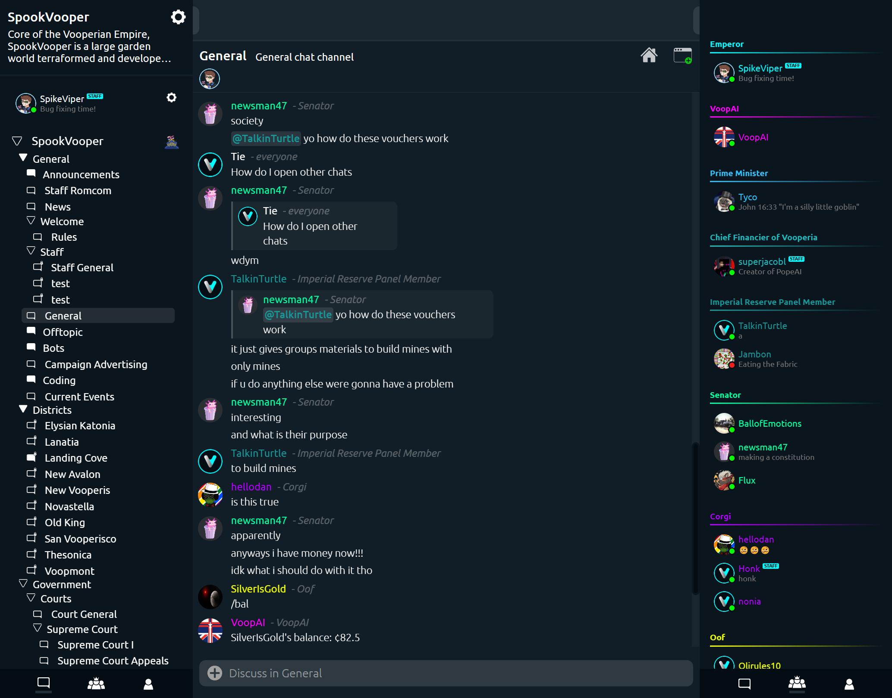
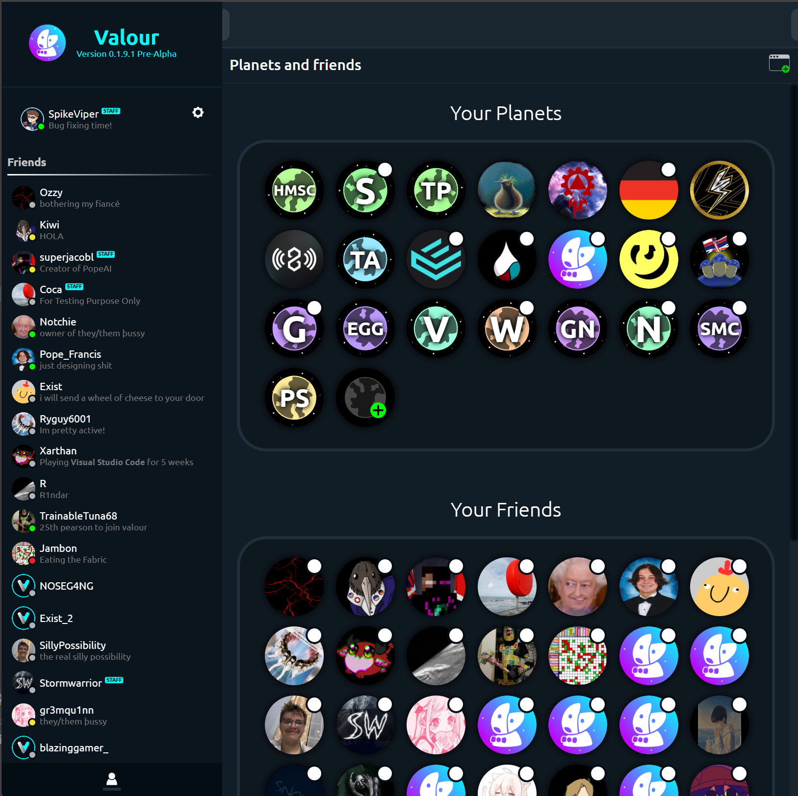

# Valour

### Valour is an open-source, modern chat client designed by communities for communities.
## Try it at: [https://valour.gg/](https://valour.gg/)
 

## Design

Valour is designed to be as flexible as possible - with a client built atop an official API for use in bots and applications. Valour is open-source, and your personal client can be as creative as your imagination allows. We believe in an open ecosystem for Valour - and hold bot authors to follow in our transparency to respect user data and privacy.

 

### Windows and Multi-chat

Valour's client allows you to open multiple chats at once - even across several communities. Valour's flexible in-built window system allows you to multitask, and for moderation teams to keep an eye on the action. Every chat window is dynamic and responsive, allowing you to resize and space your chats how you want. It's your client, after all.

 

### Planets and Communities

Planets are the communities of Valour, allowing you to build your ideas and foster strong interactions. With role management and per-channel permissions, you can ensure that your community is managed how you see fit.

 

### Economies and Items

Planets can deploy a currency and economic system in two clicks. Why? Don't bother managing 20 different 'coins' and 'xp' from different bots, and use one built-in system to handle user value tracking. Users can send your currency to each other in the community, and even trade it for community-defined items. You can even hook the API into your own systems, allowing your community members to pay for custom perks and be rewarded for anything!

 

### Total-Outage-proof Node System

Valour Nodes are designed to be able to run independantly of any central server or service. One node failing has no effect on other nodes, allowing Valour to scale safely and efficiently. Our logical-server based system, rather than depending on cloud services, also allows us to be provider-agnostic, hosting Valour across different providers and giving us the ability to dedicate resources to large communities that need it.

