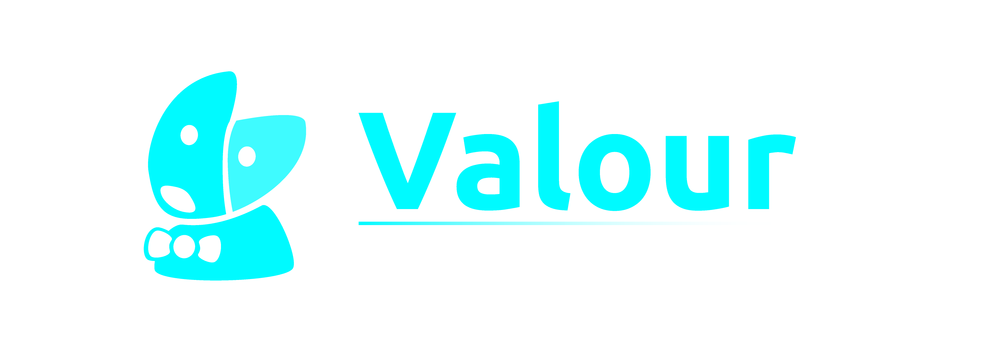
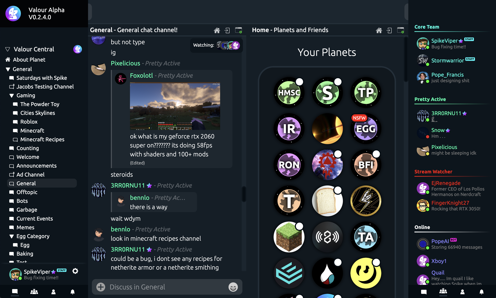
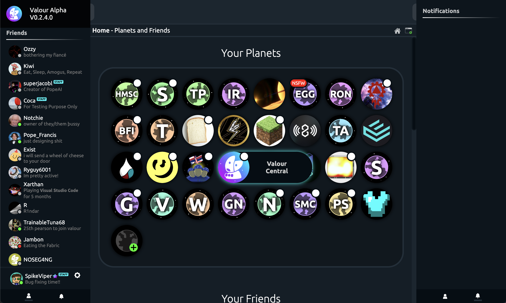

# Valour

### Valour is an open-source, modern chat client designed by communities for communities.
## Try it at: [https://valour.gg/](https://valour.gg/)
<br/>



## Design 

Valour is designed to be as flexible as possible - with a client built atop an official API for use in bots and applications. Valour is open-source, and your personal client can be as creative as your imagination allows. We believe in an open ecosystem for Valour - and hold bot authors to follow in our transparency to respect user data and privacy.

<br/>

### Windows and Multi-chat

Valour's client allows you to open multiple chats at once - even across several communities. Valour's flexible in-built window system allows you to multitask, and for moderation teams to keep an eye on the action. Every chat window is dynamic and responsive, allowing you to resize and space your chats how you want. It's your client, after all.

<br/>

### Planets and Communities

Planets are the communities of Valour, allowing you to build your ideas and foster strong interactions. With role management and per-channel permissions, you can ensure that your community is managed how you see fit.



<br/>

### Economies and Items

Planets can deploy a currency and economic system in two clicks. Why? Don't bother managing 20 different 'coins' and 'xp' from different bots, and use one built-in system to handle user value tracking. Users can send your currency to each other in the community, and even trade it for community-defined items. You can even hook the API into your own systems, allowing your community members to pay for custom perks and be rewarded for anything!

<br/>

### Total-Outage-proof Node System

Valour Nodes are designed to be able to run independently of any central server or service. One node failing has no effect on other nodes, allowing Valour to scale safely and efficiently. Our logical-server based system, rather than depending on cloud services, also allows us to be provider-agnostic, hosting Valour across different providers and giving us the ability to dedicate resources to large communities that need it.

## Federation

Federation lets a planet move from Valour's official infrastructure to an
independently operated community server without giving that server a user's
Valour login token. It has two roles:

| Role | Purpose | Configuration |
| --- | --- | --- |
| Official hub cluster | Accounts, planet registry, node verification, grants, and federation sessions. Every official Valour app instance is a hub-capable replica. | `Federation:HubEnabled=true` on every official instance; all replicas share the official database and Data Protection KEK. |
| Community node | Independently hosts planets after its operator proves control of a public domain. | `Federation:HubUrl` and `Federation:NodeDomain`; do not enable `HubEnabled`. |

Official `Node:WorkerId` values distinguish concurrent writers to the shared
official database only. They are not federation registrations and community
operators neither receive nor compete for them.

A community-node operator starts a public HTTPS server, registers its bare
domain in **User Settings → Federation** on the hub, installs the issued
challenge, and verifies it. A planet owner then opens that planet's settings →
**Federation**, enters the verified destination domain, and starts the move.
The source planet is read-only while the destination imports a signed snapshot.
The owner pastes the resulting grant into **User Settings → Federation**,
verifies the destination, and explicitly finalizes removal of the official
source copy. There is no direct community-node-to-community-node move; pull a
planet back to the hub first.

Community nodes are closed to other owners by default. Their operator may
approve a hub owner or one planet, or deliberately opt into public migration
hosting. Clients connect directly to a community node with short-lived,
destination-bound federation credentials; the user's real Valour token never
leaves the hub. See [Federation](Docs/Federation.md) for the full role model,
operator steps, security properties, and migration limits.

## Self-hosting

Run your own Valour instance with Docker Compose — Postgres, Redis, local-disk
media storage, and automatic HTTPS via Caddy, all on a single domain:

```sh
cp .env.example .env   # set your domain, passwords, and admin account
docker compose up -d
```

Point your domain's DNS at the machine and open `https://your-domain`. Media
is stored on the `media` volume by default; any S3-compatible storage (R2,
MinIO, Garage, B2) works via the `CDN__*` environment variables, and an
optional bundled MinIO is available with `docker compose --profile minio up`.
Optional services (Stripe payments, SendGrid email, Cloudflare RealtimeKit
voice, push notifications) activate when configured and the UI adapts
automatically — see [Config/appsettings.helper.json](Config/appsettings.helper.json)
for every section. Production-cluster deployment (blue/green, nginx) is
documented in [Docs/Deployment/](Docs/Deployment/README.md).

To turn a self-hosted instance into a community node, run the interactive
wizard before starting Docker Compose:

```sh
./scripts/valour-node-setup
```

It configures the community-node settings, generates the required private Data
Protection KEK, and walks through the public/approval-only migration-hosting
choice. The normal self-hosted Compose bundle is a community node, not an
official hub replica. See [Federation](Docs/Federation.md#community-node-operator-flow)
for the registration ceremony and [the deployment checklist](Docs/Deployment/README.md#federation-production-checklist)
for production requirements.

## Contribute

To contribute to Valour, set up a local server + client environment first.

### 1) Prerequisites

1. Install the .NET 11 preview SDK (the repo is pinned to `11.0.100-preview.3` in `global.json`): [https://dotnet.microsoft.com/en-us/download/dotnet/11.0](https://dotnet.microsoft.com/en-us/download/dotnet/11.0)
2. Use any IDE/editor with modern .NET support (Rider, Visual Studio, VS Code, etc.)
3. Install PostgreSQL: [https://www.postgresql.org/](https://www.postgresql.org/)
4. Install Redis: [https://redis.com/](https://redis.com/)

### 2) Restore dependencies

From the repo root:

```bash
dotnet workload restore
dotnet restore
```

### 3) Configure local settings

1. Create `Valour/Server/appsettings.json` (the file is gitignored).
2. You can start from `Config/appsettings.helper.json`.
3. Fill in at least these required sections for local startup:
   - `Database` (`Host`, `Database`, `Username`, `Password`)
   - `Redis` (`ConnectionString`)
   - `Node` (`Key`, `Name`, `Location`)
4. Optional integrations:
   - `CDN` for uploads / media storage (S3-compatible)
   - `Email` for real email delivery
   - `Notifications` for push notifications
   - `Cloudflare` for Cloudflare-backed features
     - For RealtimeKit voice, set `RealtimeAccountId`, `RealtimeAppId`, and `RealtimeApiToken`

### 4) Database setup

Valour applies EF Core migrations automatically on server startup (`db.Database.Migrate()`).

### 5) Run locally

Run the server project (it serves API + SignalR + client assets):

```bash
cd Valour/Server
dotnet run
```

Default local URLs:

- `https://localhost:5001`
- `http://localhost:5000`

### 6) Build and test

From the repo root:

```bash
dotnet build
dotnet test
```

### Notes

- The active web app flow is centered on `Valour.Client.Blazor` + server-hosted assets.
- You generally should not need to manually edit `ValourClient.cs` `BaseAddress` for normal local development.
- Docker images are published by CI, but still require valid appsettings and backing services (Postgres/Redis/etc.).

## Trademark Notice

The name "Valour" is a trademark of Valour Software LLC, and a trademark application is pending. While the project is open-source, use of the trademark must not imply endorsement by Valour Software LLC or mislead others regarding the origin of the project. 

Forks or derivative projects may not use the name "Valour" or related branding without prior written permission from Valour Software LLC. Any use of the trademark outside the scope of this project requires explicit permission. 

While use of the trademark is not permitted for forks of the project itself, use of the mark is allowed for Valour bots, plugins, or integrations. If you are unsure, contact us!
