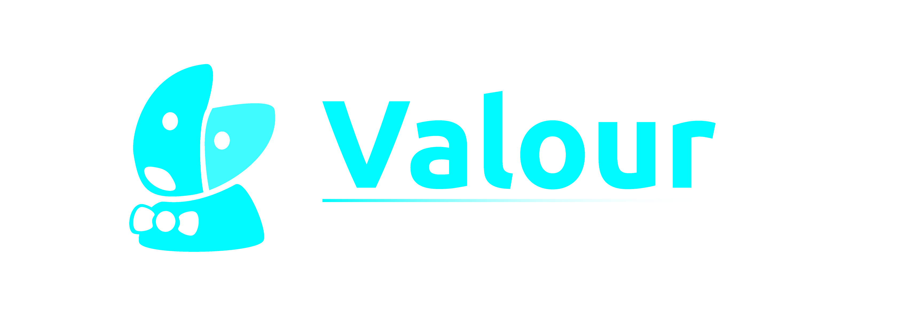
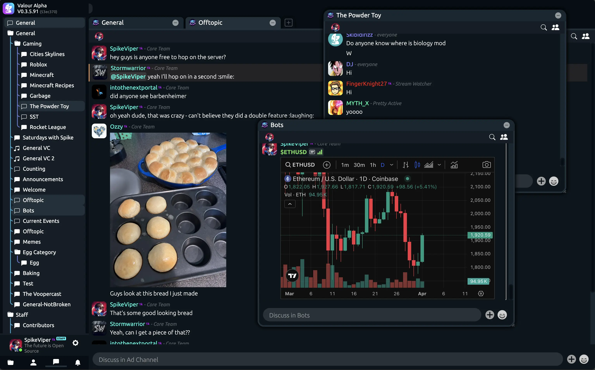

# Valour

### Valour is an open-source community platform with real-time chat, thread feeds, wikis, and voice, designed by communities for communities.

## Try it at [app.valour.gg](https://app.valour.gg) · Learn more at [valour.gg](https://valour.gg/)

[▶ Watch the platform reel](Valour/Web/wwwroot/media/videos/platform-reel.mp4)



## What Valour is

Communities on Valour live on **planets**, spaces with real-time chat channels, a reddit-style post feed, a publishable wiki, voice channels, roles and per-channel permissions, and their own economy. The client is built atop the same official API available to bots and applications, and the whole platform, client and server alike, is open source under AGPL.

- **No ads. No data selling. No ID or phone verification.** An email address is all it takes to join.
- Web app, plus Windows and Android apps ([download](https://github.com/Valour-Software/Valour/releases/latest)).
- Move an existing community over with the built-in Discord importer.

### Windows and multi-chat

Open multiple chats at once, even across communities. Valour's window system gives you tabs, splits, and resizable panes, letting you multitask and letting moderation teams keep an eye on everything at once. It's your client, after all.

### Threads: posts that persist

Every planet can enable a thread feed of lasting posts with comments, boosts, and hot/new/top sorting, so the good conversations don't scroll away. Public thread feeds get their own server-rendered pages at `threads.valour.gg`, visible to the whole web.

### Wikis with public pages

Build your community's knowledge base with a full revision history, search, and a tree of pages, then publish it to the web at `wiki.valour.gg/your-vanity-url` as a real documentation site.

### Voice channels

Drop into voice with your community. Voice runs on managed infrastructure by default, and self-hosted instances (or individual planets) can bring their own LiveKit server instead.

### Economies

Planets can deploy a currency in two clicks. Skip managing twenty different bot 'coins' and XP systems. One built-in currency tracks value, lets members pay each other, and hooks into your own systems through the API so your community can reward anything.

### Themes, bots, and automation

Restyle the entire client with community-made themes from the theme marketplace. Automate with bots and OAuth apps on the official API, pipe external services in with incoming webhooks, and let the built-in automod handle spam, blocklists, and raids.

### Node-based backend

Valour runs as a set of nodes that scale horizontally, so large communities get dedicated resources without losing features. The provider-agnostic design also keeps Valour independent of any single cloud vendor.

## Federation

Federation lets a planet move from Valour's official infrastructure to an
independently operated community server without giving that server a user's
Valour login token. It has two roles:

| Role | Purpose | Configuration |
| --- | --- | --- |
| Official hub cluster | Accounts, planet registry, node verification, grants, and federation sessions. Every official Valour app instance is a hub-capable replica. | `Federation:HubEnabled=true` on every official instance; all replicas share the official database and Data Protection KEK. |
| Community node | Independently hosts planets after its operator proves control of a public domain. | `Federation:HubUrl` and `Federation:NodeDomain`; do not enable `HubEnabled`. |

Official `Node:WorkerId` values distinguish concurrent writers to the shared
official database only. They are not federation registrations and community
operators neither receive nor compete for them.

A community-node operator starts a public HTTPS server, registers its bare
domain in **User Settings → Federation** on the hub, installs the issued
challenge, and verifies it. A planet owner then opens that planet's settings →
**Federation**, enters the verified destination domain, and starts the move.
The source planet is read-only while the destination imports a signed snapshot.
The owner pastes the resulting grant into **User Settings → Federation**,
verifies the destination, and explicitly finalizes removal of the official
source copy. There is no direct community-node-to-community-node move; pull a
planet back to the hub first.

Community nodes are closed to other owners by default. Their operator may
approve a hub owner or one planet, or deliberately opt into public migration
hosting. Clients connect directly to a community node with short-lived,
destination-bound federation credentials; the user's real Valour token never
leaves the hub. See [Federation](Docs/Federation.md) for the full role model,
operator steps, security properties, and migration limits.

## Self-hosting

Run your own Valour instance with Docker Compose: Postgres, Redis, local-disk
media storage, and automatic HTTPS via Caddy, all on a single domain:

```sh
cp .env.example .env   # set your domain, passwords, and admin account
docker compose up -d
```

Point your domain's DNS at the machine and open `https://your-domain`. Media
is stored on the `media` volume by default; any S3-compatible storage (R2,
MinIO, Garage, B2) works via the `CDN__*` environment variables, and an
optional bundled MinIO is available with `docker compose --profile minio up`.
Optional services (Stripe payments, SendGrid email, Cloudflare RealtimeKit
voice, push notifications) activate when configured and the UI adapts
automatically. See [Config/appsettings.helper.json](Config/appsettings.helper.json)
for every section. Production-cluster deployment (blue/green, nginx) is
documented in [Docs/Deployment/](Docs/Deployment/README.md).

To turn a self-hosted instance into a community node, run the interactive
wizard before starting Docker Compose:

```sh
./scripts/valour-node-setup
```

It configures the community-node settings, generates the required private Data
Protection KEK, and walks through the public/approval-only migration-hosting
choice. The normal self-hosted Compose bundle is a community node, not an
official hub replica. See [Federation](Docs/Federation.md#community-node-operator-flow)
for the registration ceremony and [the deployment checklist](Docs/Deployment/README.md#federation-production-checklist)
for production requirements.

## Contribute

To contribute to Valour, set up a local server + client environment first.

### 1) Prerequisites

1. Install the .NET 11 preview SDK (the repo is pinned to `11.0.100-preview.3` in `global.json`): [https://dotnet.microsoft.com/en-us/download/dotnet/11.0](https://dotnet.microsoft.com/en-us/download/dotnet/11.0)
2. Use any IDE/editor with modern .NET support (Rider, Visual Studio, VS Code, etc.)
3. Install PostgreSQL: [https://www.postgresql.org/](https://www.postgresql.org/)
4. Install Redis: [https://redis.com/](https://redis.com/)

### 2) Restore dependencies

From the repo root:

```bash
dotnet workload restore
dotnet restore
```

### 3) Configure local settings

1. Create `Valour/Server/appsettings.json` (the file is gitignored).
2. You can start from `Config/appsettings.helper.json`.
3. Fill in at least these required sections for local startup:
   - `Database` (`Host`, `Database`, `Username`, `Password`)
   - `Redis` (`ConnectionString`)
   - `Node` (`Key`, `Name`, `Location`)
4. Optional integrations:
   - `CDN` for uploads / media storage (S3-compatible)
   - `Email` for real email delivery
   - `Notifications` for push notifications
   - `Cloudflare` for Cloudflare-backed features
     - For RealtimeKit voice, set `RealtimeAccountId`, `RealtimeAppId`, and `RealtimeApiToken`
   - `Voice` for self-hosted LiveKit voice instead of RealtimeKit (see [Docs/Deployment/SelfHostVoice.md](Docs/Deployment/SelfHostVoice.md))

### 4) Database setup

Valour applies EF Core migrations automatically on server startup (`db.Database.Migrate()`).

### 5) Run locally

Run the server project (it serves API + SignalR + client assets):

```bash
cd Valour/Server
dotnet run
```

Default local URLs:

- `https://localhost:5001`
- `http://localhost:5000`

### 6) Build and test

From the repo root:

```bash
dotnet build
dotnet test
```

### Notes

- The active web app flow is centered on `Valour.Client.Blazor` + server-hosted assets.
- You generally should not need to manually edit `ValourClient.cs` `BaseAddress` for normal local development.
- Docker images are published by CI to `ghcr.io/valour-software/valour`, but still require valid appsettings and backing services (Postgres/Redis/etc.).

## Trademark Notice

The name "Valour" is a trademark of Valour Software LLC, and a trademark application is pending. While the project is open-source, use of the trademark must not imply endorsement by Valour Software LLC or mislead others regarding the origin of the project. 

Forks or derivative projects may not use the name "Valour" or related branding without prior written permission from Valour Software LLC. Any use of the trademark outside the scope of this project requires explicit permission. 

While use of the trademark is not permitted for forks of the project itself, use of the mark is allowed for Valour bots, plugins, or integrations. If you are unsure, contact us!
